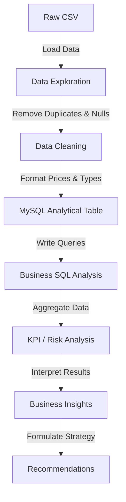

# 🛒 Zepto E-Commerce & Inventory Analytics

### MySQL-Based E-Commerce, Pricing & Inventory Analysis

This project analyzes Zepto product/SKU-level catalog and inventory data using MySQL to identify patterns in product/category composition, pricing, discounts, stock availability, estimated inventory/revenue opportunity, product value, inventory risk, and discount strategy.

> **Important**: This is a catalog/inventory dataset, NOT transaction-level sales data. All revenue-related figures are labeled as "Estimated Revenue Opportunity" or "Inventory Value" and represent the catalog inventory value at current prices.

---

## 📌 Overview

This project transforms a raw e-commerce catalog dataset into structured business insights. In the highly competitive quick-commerce space, balancing stock availability, competitive pricing, and inventory efficiency is critical. This analysis provides a data-driven approach to evaluating current catalog health, identifying supply chain risks (such as stockouts of high-margin items), and highlighting areas for potential pricing strategy adjustments.

## 🎯 Business Problem

The project addresses several key business questions:

- Which categories dominate the catalog?
- Where are stock availability problems concentrated?
- Which products/categories have the highest inventory exposure?
- How aggressive are discounts?
- Which high-value products are out of stock?
- Where is there potential inventory/revenue opportunity?
- Which categories require attention from a pricing or inventory perspective?

## 📊 Dataset

- **Raw dataset:** 3,732 rows
- **Columns:** 9
- **Categories:** 14
- **Grain:** One row represents one SKU (Stock Keeping Unit)

**Important Fields:**
- `category`: Product category (e.g., Munchies, Biscuits, Beverages)
- `name`: Product name as listed in the catalog
- `mrp`: Maximum Retail Price
- `discountPercent`: Discount applied on MRP (%)
- `discountedSellingPrice`: Final selling price
- `availableQuantity`: Units available in inventory
- `weightInGms`: Package weight in grams
- `outOfStock`: Stock status (0 = In Stock, 1 = Out of Stock)

*This dataset represents product/catalog and inventory information rather than completed sales transactions.*

## 🧹 Data Cleaning

The data cleaning workflow was executed entirely in MySQL:

1. Initial row-count validation (3,732 rows)
2. Null checks across all columns (0 nulls found)
3. Category exploration
4. Duplicate detection
5. Removal of 2 exact duplicate rows using `ROW_NUMBER()`
6. Removal of 1 invalid zero-MRP row
7. Price conversion from paise to rupees (divided by 100)
8. Stock-status conversion to MySQL-compatible representation (VARCHAR 'TRUE'/'FALSE' converted to TINYINT 1/0)
9. Weight validation (4 zero-weight rows identified and excluded from price-per-gram calculations)
10. Final cleaned-data validation

**Final cleaned analytical table contains: 3,729 rows.**

## 🛠️ Tech Stack

| Technology | Purpose |
|---|---|
| MySQL 8.0+ | Database and analytical SQL |
| SQL | Business analysis and KPI calculations |
| CSV | Source dataset |
| Power BI | Executive dashboard (Upcoming Update) |

## 🔄 Project Workflow



## 🗄️ MySQL Implementation

The project was implemented using MySQL 8.0+. Key concepts and features utilized include:

- `CREATE DATABASE` and `CREATE TABLE`
- Data types: `AUTO_INCREMENT`, `DECIMAL`, `TINYINT`, `VARCHAR`
- `LOAD DATA LOCAL INFILE` (for CSV ingestion)
- Common Table Expressions (CTEs)
- Window Functions: `ROW_NUMBER()`, `RANK()`, `SUM() OVER()`
- `CASE` expressions
- Conditional Aggregation (`SUM(CASE WHEN...)`)
- `GROUP BY` and `HAVING` clauses
- Subqueries

## 📈 Business Analysis

The 22 SQL questions are organized into six analytical sections to address specific business needs:

### Product & Category Overview (Q1–Q3)
Analyzes the overall composition of the catalog, SKU distribution across categories, basic availability rates, and average pricing levels to understand the baseline structure of the business.

### Pricing & Discount Analysis (Q4–Q9)
Examines discount strategies, highlighting the most aggressively discounted products and categories, and identifying expensive items with minimal discounts to evaluate pricing competitiveness.

### Inventory & Stock Analysis (Q10–Q13)
Focuses on current stock levels, identifying where inventory is concentrated and highlighting high-value products that are currently out of stock, representing immediate supply chain risks.

### Estimated Revenue Opportunity (Q14–Q16)
Calculates the theoretical value of in-stock inventory based on selling price and available quantity, helping to quantify category-level exposure and potential revenue gaps due to stockouts.

### Price & Product Value Analysis (Q17–Q20)
Evaluates product efficiency using price-per-gram metrics, segments products by pack size (Small, Medium, Bulk), and estimates total logistical weight per category.

### Risk & Opportunity Classification (Q21–Q22)
Uses CTEs to classify categories into risk tiers based on stockout rates and categorizes discount strategies (Aggressive, Moderate, Low/No Discount) to facilitate targeted business actions.

## 📊 KPI Framework

| KPI | Definition | Verified Value |
|---|---|---|
| **Total SKUs** | Number of cleaned SKU records | 3,729 |
| **Availability Rate** | In-stock SKUs / total SKUs | 87.9% |
| **Out-of-Stock SKUs** | Number of unavailable SKUs | 453 |
| **Average Discount** | Average discount percentage across catalog | 7.62% |
| **Available Units** | Total available quantity across all SKUs | 14,947 |
| **Estimated Revenue Opportunity** | Discounted selling price × available quantity for in-stock SKUs (estimated value) | ~₹22.41 lakh |

## 🔎 Key Insights

### 1. Stock Availability in High-Frequency Categories
**Finding:** The Biscuits category has the highest out-of-stock rate at 28.6%, followed by Beverages and Dairy at 21.7% each.

**Business implication:** These are high-frequency, repeat-purchase categories. Stockouts here directly damage customer trust and drive app abandonment to competitors.

### 2. Inventory Concentration Risk
**Finding:** Cooking Essentials and Munchies each hold an estimated ₹3.37 lakh in inventory value, together representing ~30% of total catalog inventory value.

**Business implication:** Heavy concentration in just two categories creates an imbalanced risk profile; any supply disruption here has an outsized financial impact.

### 3. Aggressive Discounting in Perishables
**Finding:** Fruits & Vegetables offers the highest average discount at 15.46% (double the catalog average of 7.62%) while maintaining a strong 93.5% availability rate.

**Business implication:** High discounts combined with high availability in a perishable category suggests potential margin compression that requires careful monitoring.

### 4. High-Value Lost Opportunities
**Finding:** Several premium, low-discount products are out of stock (e.g., Patanjali Cow's Ghee at ₹565, MamyPoko Diapers at ₹399).

**Business implication:** Premium products generate proportionally more revenue per unit. Stockouts of these high-margin items represent significant lost revenue that cannot be easily offset by cheaper items.

### 5. Extreme Discounting Anomalies
**Finding:** The maximum discount in the catalog is 51% (e.g., Dukes Waffy products), with several other items at 50%.

**Business implication:** Discounts exceeding 50% may indicate clearance pricing, loss-leaders, or margin sacrifice that warrants an immediate profitability review.

## 💼 Business Recommendations

1. **Prioritize High-Frequency Replenishment**
   **Finding:** Biscuits and Beverages have stockout rates over 21%.
   **Business implication:** Lost customer trust in daily-essential categories.
   **Action:** Conduct a vendor lead-time audit and implement automated safety stock alerts for the top 20 SKUs in these categories before inventory hits zero.

2. **Protect High-Value Inventory**
   **Finding:** Premium products (MRP > ₹300) with low discounts are frequently out of stock.
   **Business implication:** Disproportionate loss of high-margin revenue.
   **Action:** Create a "Priority SKU" watchlist for high-MRP items, assigning them dedicated inventory buffers and stricter supplier SLAs.

3. **Review Extreme Discount Profitability**
   **Finding:** Several products in Biscuits and Cooking Essentials are discounted by 50-51%.
   **Business implication:** Risk of unsustainable subsidization or negative margins.
   **Action:** Validate the P&L for these heavily discounted items; if company-funded, calculate break-even sell-through rates to ensure commercial viability.

4. **Monitor Margin on Fruits & Vegetables**
   **Finding:** F&V has an average discount of 15.46%.
   **Business implication:** Potential margin compression in an operationally expensive category.
   **Action:** Model the net margin per kg post-discount to ensure sustainability, or shift to dynamic pricing based on freshness.

5. **Address Catalog Duplication**
   **Finding:** The exact same products appear across multiple categories with identical pricing and inventory data.
   **Business implication:** Distorted category-level KPIs and inaccurate inventory planning.
   **Action:** Enforce a single primary-category assignment per SKU in the backend, using secondary tags only for search discoverability.

## ⚠️ Data Limitations

- The dataset is SKU/catalog/inventory-level.
- It is not transaction-level sales data.
- Estimated revenue opportunity is a proxy for inventory value, not actual realized revenue.
- Profit cannot be calculated because cost price data is not available.
- Customer behavior, retention, and conversion rates cannot be analyzed from this dataset.
- Inventory availability represents the captured dataset state (a single snapshot) and not necessarily historical stock levels or trends over time.
- Cross-category listings inflate category-level SKU counts.

## 📁 Project Structure

```text
zepto-SQL-data-analysis-project-main/
│
├── data/
│   └── zepto_v2.csv
│
├── sql/
│   ├── 01_database_setup.sql
│   ├── 02_data_cleaning.sql
│   ├── 03_business_analysis.sql
│   └── 04_kpi_analysis.sql
│
├── docs/
│   ├── data_dictionary.md
│   └── powerbi_setup_guide.md
│
├── README.md
└── LICENSE
```

---

## 👨‍💻 About Me

**Md Sulaiman Qamar**
Aspiring Data Analyst / Business Analyst — currently focused on MySQL, SQL-based business analysis, and Power BI.

GitHub: [github.com/DevcodeSulaiman](https://github.com/DevcodeSulaiman)
