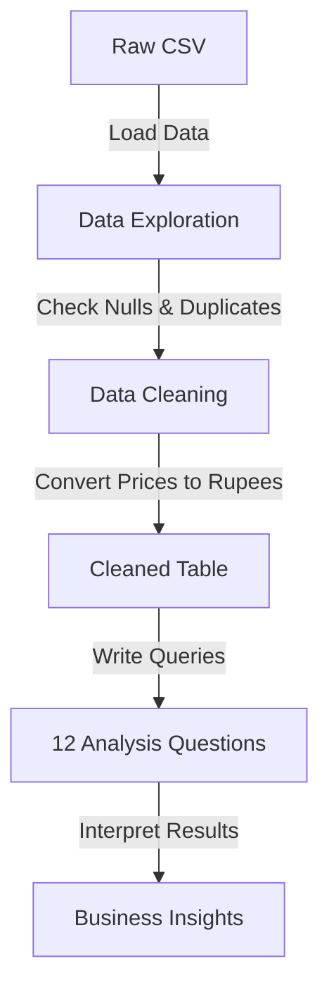

# 🛒 Zepto E-Commerce & Inventory Analytics

### MySQL-Based E-Commerce, Pricing & Inventory Analysis

This project analyzes Zepto product/SKU-level catalog and inventory data using MySQL to identify patterns in pricing, discounts, stock availability, estimated revenue opportunity, and product value.

> **Important**: This is a catalog/inventory dataset, NOT transaction-level sales data. All revenue-related figures are labeled as "Estimated Revenue Opportunity" and represent the catalog inventory value at current prices.

---

## 📌 Overview

This project transforms a raw e-commerce catalog dataset into structured business insights. In the highly competitive quick-commerce space, balancing stock availability, competitive pricing, and inventory efficiency is critical. This analysis provides a data-driven approach to evaluating current catalog health, identifying supply chain risks (such as stockouts of high-value items), and highlighting areas for pricing strategy improvements.

## 🎯 Business Problem

The project addresses several key business questions:

- Which categories dominate the catalog?
- Where are stock availability problems concentrated?
- Which products/categories have the highest inventory exposure?
- How aggressive are discounts across categories?
- Which high-value products are out of stock?
- Where is there the most estimated revenue opportunity?
- Which products give customers the best value for money?

## 📊 Dataset

- **Raw dataset:** 3,732 rows
- **After cleaning:** 3,729 rows
- **Columns:** 9
- **Categories:** 14
- **Grain:** One row represents one SKU (Stock Keeping Unit)

**Important Fields:**
- `category`: Product category (e.g., Munchies, Biscuits, Beverages)
- `name`: Product name as listed in the catalog
- `mrp`: Maximum Retail Price (in Rupees, after conversion)
- `discountPercent`: Discount applied on MRP (%)
- `discountedSellingPrice`: Final selling price (in Rupees, after conversion)
- `availableQuantity`: Units available in inventory
- `weightInGms`: Package weight in grams
- `outOfStock`: Stock status (0 = In Stock, 1 = Out of Stock)

*This dataset represents product/catalog and inventory information rather than completed sales transactions.*

## 🧹 Data Cleaning

The data cleaning was done directly in `zepto_analysis.sql`:

1. Row-count validation (3,732 rows loaded)
2. Null checks across all columns — no nulls found
3. Category exploration (14 distinct categories)
4. Identified products with the same name across multiple SKUs
5. Found and removed 1 row where `mrp = 0` (invalid entry)
6. Converted prices from **paise to rupees** (divided by 100) — the raw CSV stores prices in paise (e.g., 11000 = ₹110.00)

**Final cleaned table contains: 3,729 rows.**

## 🛠️ Tech Stack

| Technology | Purpose |
|---|---|
| MySQL 8.0+ | Database and all SQL queries |
| SQL | Data exploration, cleaning, and business analysis |
| CSV | Source dataset |

## 🔄 Project Workflow



## 🗄️ MySQL Implementation

The project uses MySQL 8.0+. Key features used:

- `CREATE DATABASE` and `CREATE TABLE` with `INT AUTO_INCREMENT`, `DECIMAL`, `TINYINT(1)`
- `LOAD DATA LOCAL INFILE` for CSV ingestion
- `DELETE` and `UPDATE` for data cleaning
- `GROUP BY`, `HAVING`, `ORDER BY`
- `CASE` expressions for classification
- Conditional aggregation with `SUM(CASE WHEN...)`
- `ROUND()`, `AVG()`, `SUM()`, `COUNT()` aggregate functions
- `DISTINCT` to avoid counting duplicate SKUs in product-level queries

## 📈 Business Analysis — 12 Questions

All 12 analysis questions are in a single file: `sql/zepto_analysis.sql`

| # | Question |
|---|---|
| Q1 | Top 10 products with the highest discount percentage |
| Q2 | High-MRP products (above ₹300) that are out of stock |
| Q3 | Estimated revenue opportunity per category |
| Q4 | Products with MRP > ₹500 but discount < 10% |
| Q5 | Top 5 categories offering the highest average discount |
| Q6 | Best value products by price per gram (items ≥ 100g) |
| Q7 | Classify products as Small / Medium / Bulk by weight |
| Q8 | Total inventory weight per category |
| Q9 | Products with the biggest absolute price drop (₹ saved) |
| Q10 | In-stock vs out-of-stock count per category |
| Q11 | Heavily discounted (>20%) yet still expensive (>₹300) products |
| Q12 | Average MRP, selling price, and discount per category |

## 📊 Key Numbers

| Metric | Value |
|---|---|
| Total SKUs (after cleaning) | 3,729 |
| In-Stock SKUs | ~3,276 (87.9%) |
| Out-of-Stock SKUs | 453 (12.1%) |
| Product Categories | 14 |
| Average Discount | ~7.62% |
| Max Discount in Catalog | 51% |

## 🔎 Key Insights

### 1. Stock Issues in High-Frequency Categories
**Finding:** Biscuits has the highest out-of-stock rate at 28.6%, followed by Beverages and Dairy at ~21.7% each.

**Business implication:** These are daily-use categories. Stockouts here directly damage customer trust and push users to competitors.

### 2. Inventory Concentration Risk
**Finding:** Cooking Essentials and Munchies together hold ~30% of the total estimated inventory value (approx. ₹3.37 lakh each).

**Business implication:** Any supply disruption in these two categories has an outsized financial impact on the business.

### 3. Aggressive Discounting in Perishables
**Finding:** Fruits & Vegetables offers the highest average discount at 15.46% — double the catalog average of 7.62% — while maintaining a 93.5% availability rate.

**Business implication:** High discounts + high availability in a perishable category can squeeze margins significantly.

### 4. Premium Products Going Out of Stock
**Finding:** Several high-MRP, low-discount products are out of stock (e.g., Patanjali Ghee at ₹565, MamyPoko Diapers at ₹399).

**Business implication:** Premium products generate more revenue per unit. Stockouts here represent significant lost revenue.

### 5. Extreme Discount Anomalies
**Finding:** The highest discount in the catalog is 51% (e.g., Dukes Waffy products), with multiple items at 50%.

**Business implication:** Discounts above 50% may indicate clearance pricing or loss-leaders that need a profitability review.

## 💼 Business Recommendations

1. **Prioritize Restocking High-Frequency Categories**
   Biscuits and Beverages have stockout rates above 21%. Implement safety stock alerts for the top SKUs in these categories before they hit zero.

2. **Protect High-Value SKUs**
   Premium products (MRP > ₹300) with low discounts shouldn't be out of stock. Create a priority watchlist with dedicated inventory buffers.

3. **Review Extreme Discount Profitability**
   Items discounted at 50–51% need a profitability check. Validate their P&L to ensure they're commercially viable.

4. **Monitor Margin on Fruits & Vegetables**
   Average discount of 15.46% in a perishable, operationally expensive category needs careful margin monitoring.

## ⚠️ Data Limitations

- This is a snapshot dataset — not historical or time-series data.
- Revenue estimates are based on catalog prices × available units, not actual completed transactions.
- Profit margins cannot be calculated as cost price is not available.
- Customer behavior (conversion, retention) cannot be analyzed from this data.

## 📁 Project Structure

```text
zepto-SQL-data-analysis-project-main/
│
├── data/
│   └── zepto_v2.csv
│
├── sql/
│   ├── zepto_analysis.sql        ← Main file (setup + cleaning + 12 questions)
│   ├── 01_database_setup.sql
│   ├── 02_data_cleaning.sql
│   └── 03_business_analysis.sql
│
├── README.md
└── LICENSE
```

---

## 👨‍💻 About Me

**Md Sulaiman Qamar**
Aspiring Data Analyst — currently focused on MySQL, SQL-based business analysis, and Power BI.

GitHub: [github.com/DevcodeSulaiman](https://github.com/DevcodeSulaiman)
